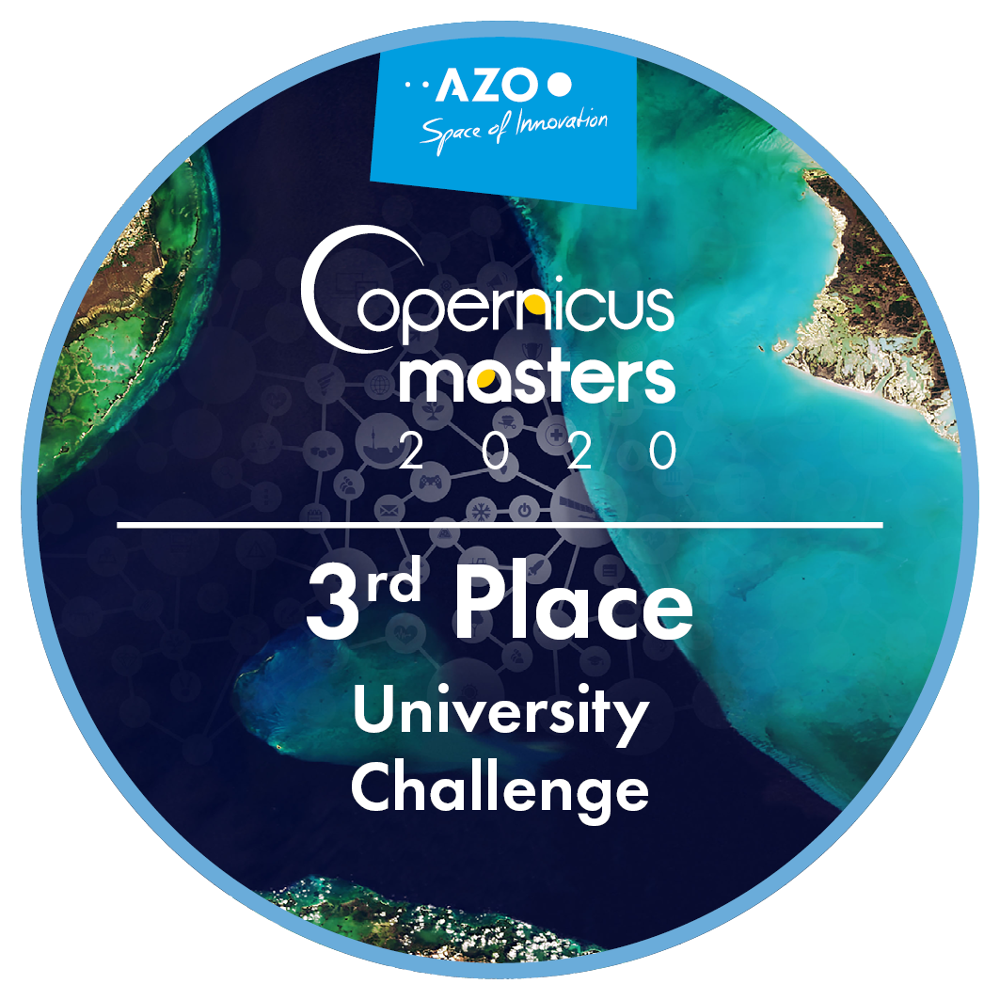

A list of stuff I've worked on is mentioned below!

### Personal Information

I graduated from Indian Institute of Technology Bombay, majoring in Material Science and Engineering.

I then spent 8 months working as an Associate consultant/Analyst at McKinsey & Company, at their risk practice, in the sub group Risk Dynamics. 

I'm presently back at IIT Bombay working with the computational Materials Science group as a research assistant.

My interest generally encompasses computational statistics and Machine learning. I've also been a part of the flagship Copernicus Accelerator by the European Space Agency, and am about to complete our first year under incubation. Suffice to say, Remote Sensing, specifically from Sentinel satellites and application of Deep learning on them is of great interest to me. More information can be found [here](https://accelerator.copernicus.eu/portfolio/budnip/#:~:text=Budnip%20uses%20Copernicus%20Sentinel%20data,indicate%20a%20crop%20disease%20outbreak.&text=Budnip%20was%20the%20winning%20team,Copernicus%20Masters%20University%20Challenge%202020.)

I'm also an avid FC Barcelona fanm and watched the Champions league game between FC Barcelona and Borussia Dortmund live at the Nou Camp. I was also an exchange student from IITB to the Technical Institute of Denmark(DTU) for the Fall semester'2019. I also managed to spend significant time travelling across the EU in my time there, and managed to visit over 15 countries.

I'm also involved in hostel football team, and the IITB Debating Society!

PS: We are now also officially 3rd in the Copernicus Masters University Challenge!

### Contact me

[adithyaiyer1999@gmail.com](mailto:adithyaiyer1999@gmail.com)